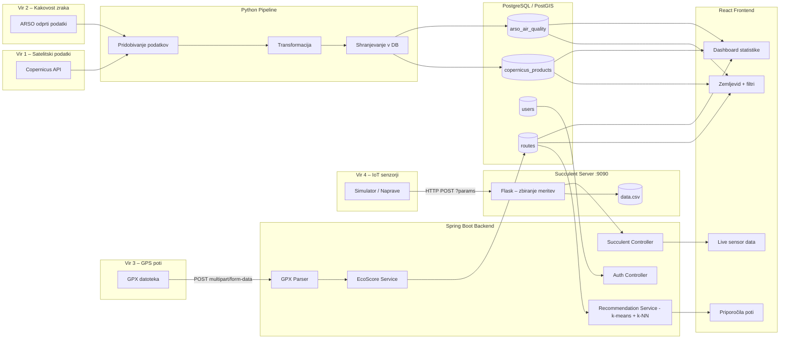
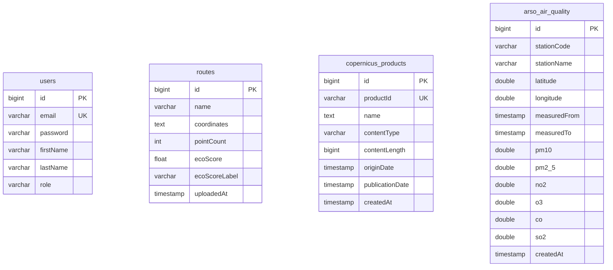
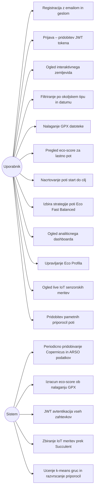
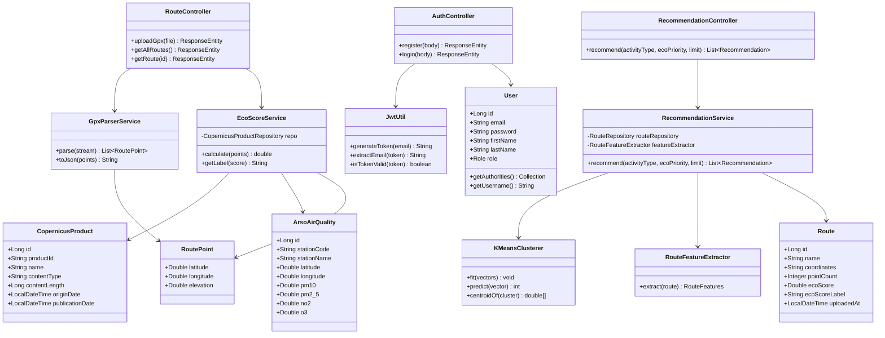
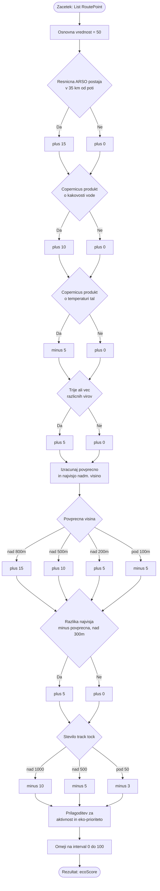
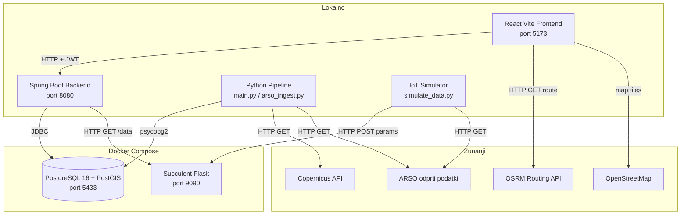
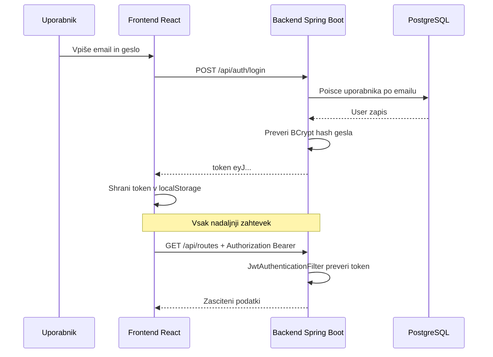
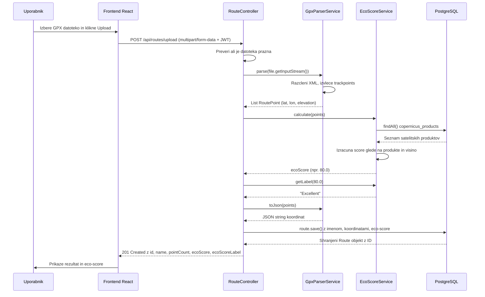
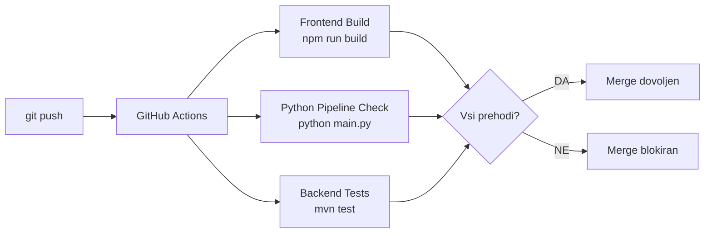

# 🌍 EcoFlow

> Platforma za vizualizacijo okoljskih podatkov in priporočanje ekološko prijaznih poti v Sloveniji.

### 🌱 Dobrodošli v EcoFlow!

Odkrijte, načrtujte in raziskujte: izkoristite moč okoljskih podatkov za bolj zeleno pot! 🚴‍♀️🌳

EcoFlow je spletna aplikacija, ki združuje **satelitske okoljske meritve** (Copernicus), **resnične podatke o kakovosti zraka** (ARSO), **GPS podatke uporabnikov** (GPX datoteke) in **IoT senzorske meritve v realnem času** (Succulent) v enoten sistem, ki uporabniku priporoča ekološko najprimernejše rekreativne poti.

Koliko dobro pravzaprav poznamo zrak, ki ga dihamo na svojem najljubšem teku ali kolesarski poti? 🌬️ EcoFlow povezuje raztresene okoljske podatke v en pregleden zemljevid in jih s pomočjo strojnega učenja spremeni v konkretno priporočilo: *katera pot je danes zate najboljša*.

Projekt se razvija v okviru učne enote *Projekt (IPT UN – 3. letnik)* na Fakulteti za elektrotehniko, računalništvo in informatiko Univerze v Mariboru.

---

## Kazalo vsebine

- [Projektna ekipa](#projektna-ekipa)
- [Namen in cilji](#namen-in-cilji)
- [Ključne funkcionalnosti](#ključne-funkcionalnosti)
- [Sistemska arhitektura](#sistemska-arhitektura)
- [Tok podatkov (Data Flow)](#tok-podatkov)
- [ER diagram – podatkovna baza](#er-diagram)
- [Use Case diagram](#use-case-diagram)
- [Razredni diagram – backend](#razredni-diagram)
- [Komponentni diagram – deployment](#komponentni-diagram)
- [REST API](#rest-api)
- [Varnost in avtentikacija](#varnost-in-avtentikacija)
- [Tehnološki sklad](#tehnološki-sklad)
- [Struktura projekta](#struktura-projekta)
- [Zagotavljanje kakovosti](#zagotavljanje-kakovosti)
- [Vodenje projekta – Scrum](#vodenje-projekta)
- [Namestitev in zagon](#namestitev-in-zagon)
- [Postavitev v produkcijo (Render.com)](#postavitev-v-produkcijo)
- [Načrtovano za prihodnje iteracije](#načrtovano-za-prihodnje-iteracije)
- [Licenca](#licenca)
- [Omejitev odgovornosti](#omejitev-odgovornosti)

---

## Projektna ekipa

| Ime in priimek       | Področje dela                         |
|----------------------|----------------------------------------|
| Kristijan Stefanoski | Backend razvoj, sistemska arhitektura |
| Anastasija Necoska   | Frontend razvoj, uporabniški vmesnik  |
| Luka Kitanovski      | Data pipeline in integracija API-jev  |
| Aleksa Vucinic       | Podatkovna baza in infrastruktura     |

---

## Namen in cilji

Projekt rešuje problem **omejene dostopnosti in interpretacije okoljskih podatkov** za navadne uporabnike. Obstoječe rešitve prikazujejo surove meritve ali statične analize, EcoFlow pa omogoča **praktična priporočila** glede na trenutne okoljske razmere.

Sistem uporabniku omogoča:
- pregled okoljskih podatkov na interaktivnem zemljevidu,
- filtriranje satelitskih meritev po tipu (kakovost zraka, temperatura tal, kakovost vode) in datumu,
- uvoz in analizo lastnih GPX rekreativnih poti,
- izračun **eco-score** vrednosti za vsako pot (0–100),
- načrtovanje poti med dvema točkama z izborom strategije (ekološka / hitra / uravnotežena),
- **pametna priporočila poti**, prilagojena aktivnosti in okoljski prioriteti uporabnika,
- pregled live IoT senzorskih meritev z naprav po Sloveniji,
- personalizacijo izkušnje prek **Eco Profila**.

---

## Ključne funkcionalnosti

🗺️ **Interaktivni zemljevid** — okoljski podatki, GPX poti in IoT meritve na eni karti (React Leaflet + OpenStreetMap), s filtriranjem po tipu podatka in datumu.

🥾 **Nalaganje in analiza GPX poti** — naloži svojo pohodniško, tekaško ali kolesarsko pot, sistem razčleni koordinate in nadmorsko višino ter izračuna **eco-score (0–100)** glede na razpoložljive okoljske podatke.

🧭 **Načrtovanje poti med dvema točkama** — izberi začetno in končno točko na zemljevidu, sistem prek OSRM izračuna alternativne poti in jih razvrsti po strategiji: **Eko** (najboljša kakovost zraka), **Hitro** (najkrajši čas) ali **Uravnoteženo**.

🤖 **Priporočila poti s strojnim učenjem** — ločen ML modul (`backend/ml`) uporablja **k-means gručenje** za odkrivanje naravnih skupin med shranjenimi potmi ter **uteženo k-NN razvrščanje** za primerjavo z uporabnikovim profilom (aktivnost + okoljska prioriteta). Rezultat je seznam poti z odstotkom ujemanja in razlago, zakaj je pot priporočena.

🌬️ **Resnični podatki o kakovosti zraka (ARSO)** — Python pipeline periodično prenese uradne podatke slovenskih merilnih postaj (Agencija RS za okolje) in jih uporabi pri izračunu eco-score, pri izbiri strategije poti ter na dashboardu.

🛰️ **Satelitski okoljski podatki (Copernicus)** — ločen pipeline prenaša produkte Copernicus Data Space API-ja (kakovost zraka, vode, temperatura tal) in jih prikazuje na zemljevidu in dashboardu.

📡 **Live IoT senzorske meritve (Succulent)** — lahek Flask strežnik zbira meritve (lokacija, kakovost zraka, temperatura, eko-ocena, tip aktivnosti); simulator pošilja resnične ARSO/Open-Meteo vrednosti z 8 lokacij po Sloveniji, brskalnik uporabnika pa lahko pošlje tudi svojo resnično GPS lokacijo.

👤 **Eco Profil** — izbira prednostne okoljske kategorije, tipa aktivnosti, regije in praga za push obvestila o poslabšanju kakovosti zraka (Web Notifications API).

📊 **Analitični dashboard** — statistika naloženih poti, satelitskih produktov in senzorskih meritev, zgodovinski trendi (30 dni / 90 dni / celotno obdobje) in zgodovina eco-ocen.

🔐 **Varna prijava** — registracija in prijava z **JWT** avtentikacijo (BCrypt gesla, stateless seje).

📱 **Odziven dizajn** — uporabniški vmesnik deluje tako na namizju kot na mobilnih napravah.

---

## Sistemska arhitektura

Sistem je razdeljen na **5 neodvisnih komponent**, ki komunicirajo prek REST API-jev in skupne podatkovne baze.

```mermaid
graph TD
    subgraph "Uporabnik"
        Browser[Brskalnik]
    end

    subgraph "Frontend – React :5173"
        MapPage[Interaktivni zemljevid]
        Dashboard[Analitični dashboard]
        GpxUpload[GPX nalaganje]
        Recommend[Priporočila poti]
        EcoProfile[Eco profil]
        LoginReg[Prijava / Registracija]
    end

    subgraph "Backend – Spring Boot :8080"
        AuthAPI[""/api/auth""]
        RoutesAPI[""/api/routes""]
        RecommendAPI[""/api/routes/recommend""]
        ProductsAPI[""/api/copernicus-products""]
        AirQualityAPI[""/api/air-quality""]
        SucculentAPI[""/api/succulent-data""]
        HealthAPI[""/api/health""]
    end

    subgraph "Podatkovna baza"
        DB[(PostgreSQL / PostGIS :5433)]
    end

    subgraph "Succulent – IoT zbiratelj :9090"
        SucculentServer[Succulent Flask Server]
        Simulator[IoT Simulator]
    end

    subgraph "Zunanji viri"
        Copernicus[Copernicus Data Space API]
        ARSO[ARSO odprti podatki]
        OSRM[OSRM Route API]
        OSM[OpenStreetMap Tiles]
    end

    subgraph "Python Pipeline"
        Pipeline[main.py / scheduler.py]
        ArsoPipeline[arso_ingest.py]
    end

    Browser --> MapPage & Dashboard & GpxUpload & Recommend & EcoProfile & LoginReg
    MapPage & Dashboard & GpxUpload & Recommend & EcoProfile --> AuthAPI & RoutesAPI & RecommendAPI & ProductsAPI & AirQualityAPI & SucculentAPI
    AuthAPI & RoutesAPI & RecommendAPI & ProductsAPI & AirQualityAPI --> DB
    SucculentAPI --> SucculentServer
    Pipeline --> Copernicus
    Pipeline --> DB
    ArsoPipeline --> ARSO
    ArsoPipeline --> DB
    Simulator --> SucculentServer
    Simulator --> ARSO
    MapPage --> OSRM
    MapPage --> OSM
```



---

## Tok podatkov

Podatki v sistem prihajajo iz štirih neodvisnih virov in se združijo v eno podatkovno bazo ter prikažejo v frontendu.



**Razlaga toka:**

1. **Python pipeline** periodično pokliče Copernicus API in ARSO odprte podatke, transformira odgovor in shrani satelitske produkte ter meritve kakovosti zraka v bazo. Ob nedosegljivosti API-ja se uporabi lokalni testni dataset.
2. **Uporabnik naloži GPX datoteko** → backend jo razčleni, izvleče koordinate in višino, izračuna eco-score ter shrani pot v bazo.
3. **Recommendation Service** ob vsaki zahtevi iz shranjenih poti nauči k-means gruče in jih uteženo primerja z uporabnikovim profilom, da vrne razvrščen seznam priporočil.
4. **IoT simulator** pošilja resnične ARSO/vremenske meritve na Succulent strežnik (HTTP POST z URL parametri). Backend na zahtevo frontendu posreduje zadnje meritve iz Succulent strežnika.

---

## ER diagram

Podatkovna baza vsebuje štiri glavne entitete:



- `users.email` je unikaten in se uporablja kot uporabniško ime za JWT
- `routes.coordinates` hrani JSON array `[{latitude, longitude, elevation}, ...]`
- `copernicus_products.productId` je unikaten ID iz Copernicus kataloga – duplikati se ob konfliktu posodobijo (upsert)
- `arso_air_quality` hrani meritve po merilni postaji in časovnem oknu – kombinacija `stationCode` + `measuredFrom` je unikatna (upsert)

> Opomba: V prihodnji iteraciji bo dodana relacija `user_id` na tabeli `routes`, da vsak uporabnik vidi samo svoje poti.

---

## Use Case diagram



---

## Razredni diagram

Razredni diagram prikazuje ključne entitete in servise backend aplikacije.



**Logika izračuna eco-score – activity diagram:**



**Tabela točkovanja** (ustreza `EcoScoreService.calculate()`):

| Pogoj | Točke |
|-------|-------|
| Osnovna vrednost | +50 |
| Resnična ARSO postaja v 35 km od poti | **+15** |
| Copernicus produkt o kakovosti vode v bazi | +10 |
| Copernicus produkt o temperaturi tal v bazi | **-5** |
| 3 ali več različnih virov podatkov skupaj | +5 |
| Povprečna nadmorska višina > 800 m | +15 |
| Povprečna nadmorska višina > 500 m | +10 |
| Povprečna nadmorska višina > 200 m | +5 |
| Povprečna nadmorska višina < 100 m | -5 |
| Razlika najvišja–povprečna višina > 300 m | +5 |
| Pot ima > 1000 track točk | -10 |
| Pot ima > 500 track točk | -5 |
| Pot ima < 50 track točk | -3 |
| Aktivnost (hoja/tek/kolesarjenje) glede na prioriteto | ±3 do ±8 |
| Eko-prioriteta (zrak/voda/temperatura) iz profila | ±3 do ±8 |

Končna vrednost je omejena na interval **[0, 100]** in zaokrožena na 1 decimalko.

> Opomba: kakovost zraka se preverja geografsko natančno (resnična razdalja do najbližje ARSO postaje), medtem ko kakovost vode in temperatura uporabljata Copernicus produkte iz cele baze brez geografskega filtra, ker ti produkti v bazi nimajo koordinat.

**Logika priporočil poti** (`RecommendationService`) deluje ločeno od eco-score izračuna: vsaka pot v bazi se pretvori v vektor značilk (povprečna/najvišja nadmorska višina, vzpon, dolžina, št. točk, eco-score), ki se normalizira na 0–1. Nad temi vektorji se ob vsaki zahtevi znova nauči **k-means gručenje** (Lloydov algoritem), uporabnikov profil pa se pretvori v "idealni" vektor in primerja z vsako potjo prek **utežene evklidske razdalje**. Pripadnost naučeni gruči rezultat še dodatno prilagodi, končni razmak pa se pretvori v odstotek ujemanja (0–100 %).

---

## Komponentni diagram

Prikazuje, kako posamezne komponente tečejo lokalno in kateri porti so izpostavljeni.



Za produkcijsko postavitev (Render.com) glej [Postavitev v produkcijo](#postavitev-v-produkcijo).

---

## REST API

Vsi endpointi (razen `/api/health` in `/api/auth/**`) zahtevajo JWT Bearer token:

```
Authorization: Bearer <token>
```

### Avtentikacija

| Metoda | Endpoint             | Opis                           | Avtentikacija |
|--------|----------------------|--------------------------------|---------------|
| POST   | `/api/auth/register` | Registracija novega uporabnika | Ne            |
| POST   | `/api/auth/login`    | Prijava, vrne JWT token        | Ne            |
| GET    | `/api/health`        | Statusni pregled sistema       | Ne            |

**Primer prijave:**
```json
POST /api/auth/login
{ "email": "user@example.com", "password": "geslo123" }

Odgovor:
{ "token": "eyJhbGciOiJIUzI1NiJ9..." }
```

### Okoljski podatki

| Metoda | Endpoint                   | Opis                                          |
|--------|----------------------------|------------------------------------------------|
| GET    | `/api/copernicus-products` | Vrne vse satelitske produkte iz baze          |
| GET    | `/api/air-quality`         | Vrne zadnje meritve kakovosti zraka (ARSO)    |

### GPX Poti in priporočila

| Metoda | Endpoint                | Opis                                                          |
|--------|--------------------------|----------------------------------------------------------------|
| POST   | `/api/routes/upload`     | Naloži GPX datoteko, izračuna eco-score                      |
| GET    | `/api/routes`            | Vrne seznam vseh poti (brez koordinat)                        |
| GET    | `/api/routes/{id}`       | Vrne posamezno pot z vsemi koordinatami                       |
| GET    | `/api/routes/recommend`  | Vrne priporočene poti glede na `activityType` in `ecoPriority` |

**Primer odgovora za nalaganje GPX:**
```json
{
  "id": 5,
  "name": "gorska_pot.gpx",
  "pointCount": 347,
  "ecoScore": 80.0,
  "ecoScoreLabel": "Excellent"
}
```

**Primer klica priporočil:**
```
GET /api/routes/recommend?activityType=CYCLING&ecoPriority=AIR_QUALITY&limit=3
```

### Succulent IoT podatki

| Metoda | Endpoint               | Opis                                           |
|--------|------------------------|------------------------------------------------|
| GET    | `/api/succulent-data`  | Vrne zadnje IoT meritve iz Succulent strežnika |
| POST   | `/api/succulent-data`  | Zabeleži novo meritev (npr. resnično lokacijo uporabnika) |

**Primer odgovora (ko succulent teče):**
```json
[
  {
    "latitude": "46.0612",
    "longitude": "14.5021",
    "air_quality": "78.3",
    "temperature": "21.5",
    "eco_score": "82.1",
    "activity_type": "WALKING",
    "timestamp": "2024-06-05T10:23:11"
  }
]
```

**Ob nedosegljivosti Succulent strežnika:**
```json
{
  "status": "unavailable",
  "message": "Succulent data collection server is not running.",
  "data": []
}
```

---

## Varnost in avtentikacija

Sistem uporablja **JWT (JSON Web Token)** avtentikacijo brez strežniških sej (stateless).



**Varnostni mehanizmi:**
- Gesla hashirana z **BCrypt** (nikoli shranjeno v čistem tekstu)
- JWT token vsebuje email in čas veljavnosti, podpisan s HMAC ključem (`jwt.secret`)
- `JwtAuthenticationFilter` preveri vsak zahtevek pred dostopom do zaščitenih virov
- `LoginAttemptTracker` blokira prijavo za dani email po 5 neuspešnih poskusih znotraj 15 minut (zaščita pred brute-force napadi)
- CORS dovoljeni izvori in headerji so eksplicitno omejeni (ne `*`), konfigurabilni prek `cors.allowed-origins`
- Eksplicitni varnostni odzivni headerji (`frameOptions: deny`, HSTS)
- Seje so **stateless** (`SessionCreationPolicy.STATELESS`)

### Sequence diagram – nalaganje GPX poti

Ključni tok: od nalaganja datoteke do shranjenega eco-score v bazi.



---

## Tehnološki sklad

| Plast           | Tehnologija             | Namen                                |
|-----------------|--------------------------|----------------------------------------|
| Frontend        | React 19 + Vite          | Uporabniški vmesnik (SPA)            |
| Frontend        | React Leaflet            | Interaktivni zemljevid               |
| Frontend        | React Router             | Navigacija med stranmi               |
| Frontend        | Axios                    | HTTP zahtevki na backend             |
| Backend         | Spring Boot 3            | REST API strežnik                    |
| Backend         | Spring Security 6        | JWT avtentikacija                    |
| Backend         | Lombok                   | Redukcija boilerplate kode           |
| Backend         | Lasten ML modul (`backend.ml`) | K-means gručenje + uteženo k-NN razvrščanje za priporočila poti |
| Podatkovna baza | PostgreSQL 16 + PostGIS  | Relacijska baza s prostorsko razšir. |
| Pipeline        | Python + Requests        | Pridobivanje Copernicus in ARSO podatkov |
| Pipeline        | psycopg2                 | Povezava s PostgreSQL iz Pythona     |
| IoT zbiranje    | Succulent (Flask)        | HTTP POST zbiratelj meritev          |
| IoT simulator   | Python + resnični ARSO/Open-Meteo podatki | Simulacija IoT naprav z resničnimi okoljskimi vrednostmi |
| Routing         | OSRM (project-osrm.org)  | Izračun pešpoti med točkami          |
| Zemljevid       | OpenStreetMap             | Podloga karte                        |
| Testiranje      | Vitest, JUnit 5, Mockito | Avtomatizirani testi frontend/backend |
| Infrastruktura  | Docker + Compose         | Kontejnerizacija baze in Succulenta   |
| Produkcija      | Render.com               | Gostovanje frontenda, backenda, baze in Succulenta |
| CI/CD           | GitHub Actions           | Avtomatsko testiranje ob push-u      |

### Utemeljitev arhitekturnih odločitev

**Zakaj React?**
React omogoča komponentno gradnjo vmesnika, kar je ključno za kompleksen projekt z zemljevidom, dashboardom in večimi stranmi. Vite zagotavlja izredno hitro lokalno razvojno okolje z HMR (hot module replacement).

**Zakaj Spring Boot?**
Ekipa ima predhodno znanje z Javo. Spring Boot ponuja celovit ekosistem: vgrajeno varnost (Spring Security), ORM (Hibernate/JPA), in enostavno vzpostavitev REST API-ja brez konfiguracije od začetka. JWT integracija je standardizirana.

**Zakaj PostgreSQL + PostGIS?**
Projekt dela s prostorskimi podatki (GPS koordinate, geografske regije). PostGIS razširitev PostgreSQL dodaja prostorske tipe in indekse, kar bo v prihodnosti omogočilo napredne prostorske poizvedbe (npr. kateri okoljski podatki so znotraj 5 km od poti). PostgreSQL je tudi brezplačen in odprtokoden.

**Zakaj Python za pipeline?**
Python ima najbogatejši ekosistem za obdelavo podatkov (Pandas, Requests). Copernicus in ARSO API-ja vračata kompleksne XML/JSON odgovore, ki jih je v Pythonu enostavno transformirati. Pipeline je ločena komponenta, kar omogoča neodvisno izvajanje brez vplivanja na backend.

**Zakaj lasten k-means modul namesto knjižnice?**
Podatkovna množica (uporabniške poti) je majhna in se spreminja v realnem času z vsakim novim GPX nalaganjem, zato se model uči sproti, ob vsaki zahtevi – dodajanje težke ML knjižnice (npr. Spark MLlib) za tako majhen problem ne bi bilo smiselno. Lloydov algoritem je preprost in transparenten za razlago v okviru predmeta.

**Zakaj Succulent?**
Succulent je lahek Flask-based strežnik, ki zbira podatke prek HTTP POST zahtevkov — standardni protokol za IoT naprave. Mentor je predlagal vključitev platforme za zbiranje podatkov, da pokrijemo celoten podatkovni ekosistem (satelit + GPS + IoT senzorji). Ker nimamo fizičnih naprav, simulator posnema realne meritve z resničnimi ARSO/vremenskimi podatki.

**Zakaj Docker samo za bazo in Succulent?**
V razvojni fazi je kontejnerizacija celotnega sistema prekomplicirana. Docker zagotavlja konzistentno PostgreSQL okolje na vseh razvojnih računalnikih brez ročne namestitve. Backend, frontend in pipeline tečejo lokalno za lažje debugiranje; v produkciji (Render.com) pa so vse komponente kontejnerizirane prek istih Dockerfile-jev.

**Zakaj Render.com za produkcijo?**
Render omogoča brezplačno gostovanje statičnih strani, Docker web servisov in PostgreSQL baze neposredno iz GitHub repozitorija (`render.yaml` Blueprint), kar je idealno za akademski projekt brez proračuna za infrastrukturo.

**Zakaj GitHub Actions za CI/CD?**
GitHub Actions je tesno integriran z repozitorijem in brezplačen za javne repozitorije. Zagotavlja, da nobena koda z neuspešnimi testi ne pride v vejo `main`, kar je temelj zagotavljanja kakovosti.

---

## Struktura projekta

```
ecoflow/
│
├── frontend/                           # React aplikacija (Vite)
│   └── src/
│       ├── App.jsx                     # Glavna aplikacija, routing, interaktivni zemljevid
│       ├── config.js                   # API_BASE_URL (env-konfigurabilen naslov backenda)
│       ├── pages/
│       │   ├── LoginPage.jsx           # Stran za prijavo
│       │   ├── RegisterPage.jsx        # Stran za registracijo
│       │   ├── GpxUploadPage.jsx       # Nalaganje GPX datotek
│       │   ├── StatsDashboardPage.jsx  # Dashboard + live sensor data
│       │   ├── RecommendationsPage.jsx # Pametna priporočila poti
│       │   └── EcoProfilePage.jsx      # Eco profil uporabnika
│       ├── services/
│       │   └── authService.js          # JWT shranjevanje / preverjanje
│       └── test/                       # Frontend unit testi (Vitest)
│
├── backend/                            # Spring Boot aplikacija
│   ├── Dockerfile                      # Kontejnerizacija za Render/produkcijo
│   └── src/main/java/backend/
│       ├── config/
│       │   ├── SecurityConfig.java             # Spring Security + CORS + JWT filter
│       │   ├── JwtAuthenticationFilter.java    # Preverjanje JWT pri vsakem zahtevku
│       │   └── JwtUtil.java                    # Generiranje in validacija JWT tokenov
│       ├── controller/
│       │   ├── AuthController.java             # POST /api/auth/register + /login
│       │   ├── RouteController.java            # POST /upload, GET /api/routes
│       │   ├── RecommendationController.java   # GET /api/routes/recommend
│       │   ├── CopernicusProductController.java
│       │   ├── AirQualityController.java       # GET /api/air-quality (ARSO)
│       │   └── SucculentDataController.java    # GET/POST /api/succulent-data
│       ├── ml/
│       │   ├── RecommendationService.java      # k-means + uteženo k-NN razvrščanje
│       │   ├── KMeansClusterer.java             # Lloydov algoritem
│       │   ├── RouteFeatureExtractor.java       # Pot -> vektor značilk
│       │   └── RouteFeatures.java, Recommendation.java
│       ├── model/
│       │   ├── User.java, Route.java, RoutePoint.java
│       │   ├── CopernicusProduct.java, ArsoAirQuality.java, Role.java
│       ├── repository/                 # JPA repozitoriji (Spring Data)
│       └── service/
│           ├── EcoScoreService.java    # Algoritem za izračun eco-score
│           └── GpxParserService.java  # Razčlenjevanje GPX XML datotek
│
├── pipeline/                           # Python data pipeline
│   ├── main.py                         # Copernicus: pridobivanje + transformacija + shranjevanje
│   ├── arso_ingest.py                  # ARSO: pridobivanje + transformacija + shranjevanje
│   ├── scheduler.py                    # Periodično izvajanje pipeline-a
│   └── test_data/                      # Lokalni testni dataseti (fallback)
│
├── succulent/                          # IoT zbiratelj podatkov
│   ├── Dockerfile                      # Kontejnerizacija za Render/produkcijo
│   ├── run.py                          # Zagon Succulent strežnika na :9090
│   ├── configuration.yml               # Definicija parametrov (lat, lng, air_quality...)
│   ├── simulate_data.py                # Simulator IoT naprav (resnični ARSO/Open-Meteo podatki)
│   └── requirements.txt
│
├── docker/
│   └── docker-compose.yml              # PostgreSQL + PostGIS + Succulent kontejnerja
│
├── render.yaml                         # Render.com Blueprint (produkcijska postavitev)
│
├── docks/                              # Dodatna dokumentacija
│   ├── diagrams/                       # UML diagrami
│   ├── architecture/                   # Arhitekturne odločitve
│   └── sprints/                        # Sprint dokumentacija
│
└── .github/workflows/                  # GitHub Actions CI pipeline
```

---

## Zagotavljanje kakovosti

### Avtomatizirani testi

**Frontend – Vitest + React Testing Library:**
```
frontend/src/test/
├── LoginPage.test.jsx       # Testira prikaz forme, validacijo, napake
├── RegisterPage.test.jsx    # Testira registracijo, duplikat email
└── GpxUploadPage.test.jsx   # Testira nalaganje datoteke, odgovor backenda
```

**Backend – JUnit 5 + Mockito:**
```
backend/src/test/java/backend/
├── controller/RouteControllerTest.java      # Unit testi za upload GPX in pridobivanje
└── integration/
    ├── AuthIntegrationTest.java             # E2E test registracije in prijave
    └── RouteIntegrationTest.java            # E2E test nalaganja in branja poti
```

### CI/CD pipeline (GitHub Actions)

Ob vsakem `push` ali `pull_request` v vejo `main` se samodejno izvede:



Merge v `main` je mogoč šele, ko **vsi trije koraki** uspešno zaključijo.

---

## Vodenje projekta

Projekt temelji na **Scrum** agilni metodologiji z **enotedenskimi sprint iteracijami**.

**Orodja:**
- **GitHub Issues** – sledenje nalogam in napakam
- **GitHub Projects (Kanban)** – vizualizacija statusa (To Do / In Progress / Done)
- **Pull Requests** – obvezen code review pred mergom v `main`
- **GitHub Actions** – avtomatizirano testiranje ob vsaki spremembi

### Zaključene iteracije

| Iteracija | Vsebina                                                                      | Status     |
|-----------|--------------------------------------------------------------------------------|------------|
| 1         | Vzpostavitev okolja (frontend, backend, baza), osnoven REST API              | ✅ Končano |
| 2         | Python data pipeline, pridobivanje Copernicus podatkov, shranjevanje v bazo  | ✅ Končano |
| 3         | Interaktivni zemljevid (Leaflet), prikaz okoljskih podatkov, filtriranje     | ✅ Končano |
| 4         | GPX uvoz, izračun eco-score, prikaz poti na zemljevidu                       | ✅ Končano |
| 5         | Eco Profil, dashboard, Succulent IoT integracija, CI/CD, personalizacija     | ✅ Končano |
| 6         | ARSO integracija, ML priporočila poti (k-means + k-NN), odziven mobilni prikaz, postavitev v produkcijo | ✅ Končano |

---

## Namestitev in zagon

Sledi navodilom po korakih za posamezno komponento – po vrstnem redu spodaj.

### Predpogoji

- **Java 21+** – za Spring Boot backend
- **Node.js 18+** – za React frontend
- **Python 3.9+** – za pipeline in succulent
- **Docker + Docker Compose** – za PostgreSQL in Succulent
- **Maven** – za backend build

### 1. Kloniranje repozitorija

```bash
git clone https://github.com/Lupet007/ecoflow.git
cd ecoflow
```

### 2. Podatkovna baza in Succulent (Docker)

```bash
cd docker
docker-compose up -d
```

To zažene dva kontejnerja:
- **PostgreSQL + PostGIS** na `localhost:5433` (baza `ecoflow`, uporabnik `ecoflow`, geslo `ecoflow`)
- **Succulent Flask strežnik** na `localhost:9090`

### 3. Backend (Spring Boot)

```bash
cd backend
mvn spring-boot:run
```

Backend teče na `http://localhost:8080`. Spring Boot ob prvem zagonu samodejno ustvari tabele (Hibernate DDL auto). Privzeta konfiguracija (`application.properties`) povezuje backend na lokalno bazo in Succulent brez dodatnega nastavljanja – za produkcijsko okolje glej [Postavitev v produkcijo](#postavitev-v-produkcijo).

### 4. Python pipeline (enkratno)

```bash
cd pipeline
pip install -r requirements.txt
python main.py           # Copernicus satelitski podatki
python arso_ingest.py    # ARSO kakovost zraka
```

Oba skripta ob nedosegljivosti zunanjega API-ja samodejno uporabita lokalni testni dataset. Za povezavo na drugo bazo (npr. produkcijsko) nastavi okoljske spremenljivke `DB_HOST`, `DB_PORT`, `DB_NAME`, `DB_USER`, `DB_PASSWORD`.

### 5. Frontend (React + Vite)

```bash
cd frontend
npm install
npm run dev
```

Frontend teče na `http://localhost:5173`.

### 6. IoT simulator (opcijsko)

Za prikaz **Live sensor data** sekcije v dashboardu, v novem terminalu:

```bash
cd succulent
python simulate_data.py
```

Simulator pošilja meritve vsakih nekaj sekund z 8 lokacij po Sloveniji, z resničnimi vrednostmi kakovosti zraka (ARSO) in temperature (Open-Meteo).

### Povzetek portov

| Komponenta       | Port | URL                        |
|------------------|------|-----------------------------|
| Frontend (React) | 5173 | http://localhost:5173      |
| Backend (Spring) | 8080 | http://localhost:8080      |
| PostgreSQL       | 5433 | localhost:5433              |
| Succulent IoT    | 9090 | http://localhost:9090      |

---

## Postavitev v produkcijo

Poleg lokalnega razvoja je EcoFlow gostovan tudi v produkciji prek **Render.com**, z avtomatskim deployem ob vsakem push-u v vejo `main`.

Repozitorij vsebuje `render.yaml` Blueprint, ki ob prvi postavitvi samodejno ustvari:

| Servis              | Tip                     | Opis                                     |
|----------------------|--------------------------|--------------------------------------------|
| `ecoflow-db`         | PostgreSQL (free)       | Produkcijska baza                          |
| `ecoflow-backend`    | Docker web servis       | Spring Boot backend (`backend/Dockerfile`) |
| `ecoflow-succulent`  | Docker web servis       | Succulent IoT strežnik (`succulent/Dockerfile`) |
| `ecoflow-frontend`   | Statična stran          | React build (`npm run build`)              |

Vse okoljsko-odvisne nastavitve (naslov backenda za frontend, dovoljeni CORS izvori, naslov Succulent strežnika, povezava na bazo) so prek okoljskih spremenljivk – privzete vrednosti ustrezajo lokalnemu razvoju, v Render nadzorni plošči pa se nastavijo produkcijske vrednosti.

> Ker Render brezplačni plan nima brezplačnega Cron Job servisa, se IoT simulator v produkciji zažene ročno (glej korak 6 zgoraj), z `SUCCULENT_URL` nastavljenim na naslov produkcijskega Succulent servisa.

---

## Načrtovano za prihodnje iteracije

Naslednje funkcionalnosti so bile **opredeljene v začetni viziji projekta**, vendar **niso bile implementirane** zaradi časovnih omejitev ali tehničnih odvisnosti. Predvidene so za nadaljevanje razvoja.

### Gostujoči uporabnik (Guest mode)

Vizija je predvidevala, da bo mogoč ogled zemljevida **brez prijave** – gostujoči uporabnik bi videl okoljske podatke, ne bi pa imel dostopa do GPX uvoza, priporočil in profila. Trenutno sistem zahteva prijavo za vse funkcionalnosti.

### Napredni filtri onesnaževal

Vizija je vključevala filtriranje po specifičnih onesnažilih: **PM2.5, NO2, temperatura**. ARSO podatki že vsebujejo te vrednosti v bazi, trenutna uporabniška vmesnik pa jih še ne izpostavlja kot ločene filtre, le kot splošne tipe (kakovost zraka, kakovost vode, temperatura tal).

### Toplotna karta

Gumb za prikaz toplotne karte je v dashboardu že pripravljen v vmesniku, a funkcionalnost še ni omogočena (glej "Stanje sistema" na dashboardu).

### Zgodovinski trendi in primerjava regij

Dashboard prikazuje statistiko in časovne trende, ne pa še neposredne primerjave med regijami.

### Personalizirana priporočila za zdravstveno občutljive uporabnike

Vizija je predvidevala prilagojene filtre in priporočila za uporabnike z zdravstvenimi posebnostmi (npr. astmatiki). Eco Profil trenutno podpira izbiro aktivnosti, regije in praga za obvestila, ne pa zdravstvenih parametrov.

### Relacija med uporabnikom in potmi

Trenutno so vse poti vidne vsem prijavljenim uporabnikom. Načrtovana je uvedba `user_id` tujega ključa na tabeli `routes`, da vsak uporabnik vidi in upravlja samo svoje poti.

### Samodejno periodično zbiranje IoT meritev v produkciji

Trenutno se simulator v produkciji zažene ročno, ker brezplačni Render plan ne vključuje Cron Job servisa. Načrtovana je nadgradnja na plačljiv plan ali alternativna rešitev za samodejno periodično pošiljanje meritev.

---

## Licenca

Projekt je razvit za akademske in izobraževalne namene v okviru učne enote Projekt (IPT UN) na FERI, Univerza v Mariboru, in je na voljo pod licenco **MIT**. Licenco najdete v datoteki [LICENSE](LICENSE).

---

## Omejitev odgovornosti

Ta projekt je nastal v okviru fakultetnega predmeta in služi predvsem izobraževalnim namenom. Okoljski podatki (Copernicus, ARSO) in IoT meritve so resnični, kjer je to označeno, vendar aplikacija ni namenjena za uporabo pri kritičnih zdravstvenih ali varnostnih odločitvah. Uporaba na lastno odgovornost. 🌿
