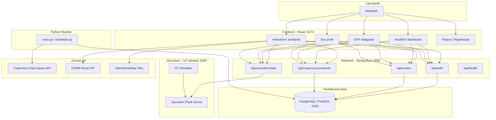
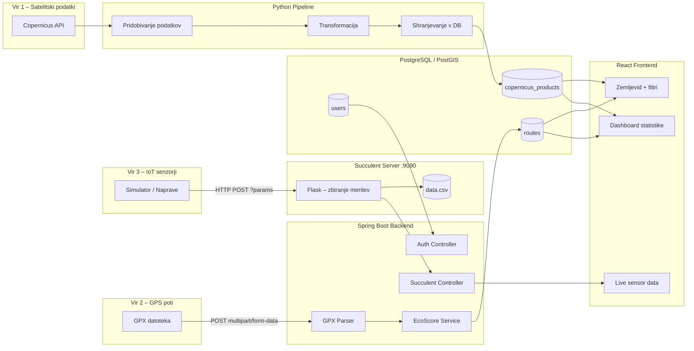
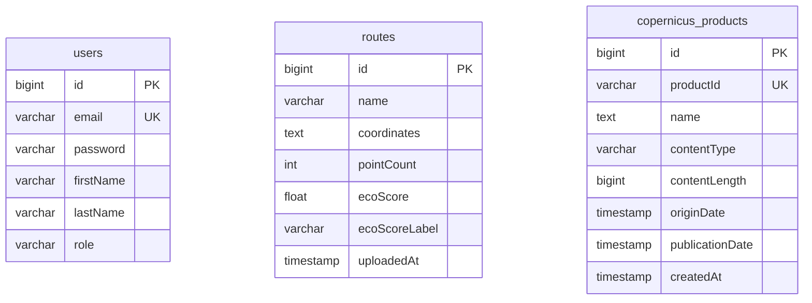
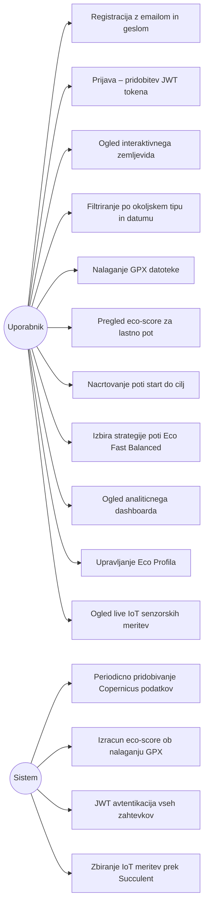
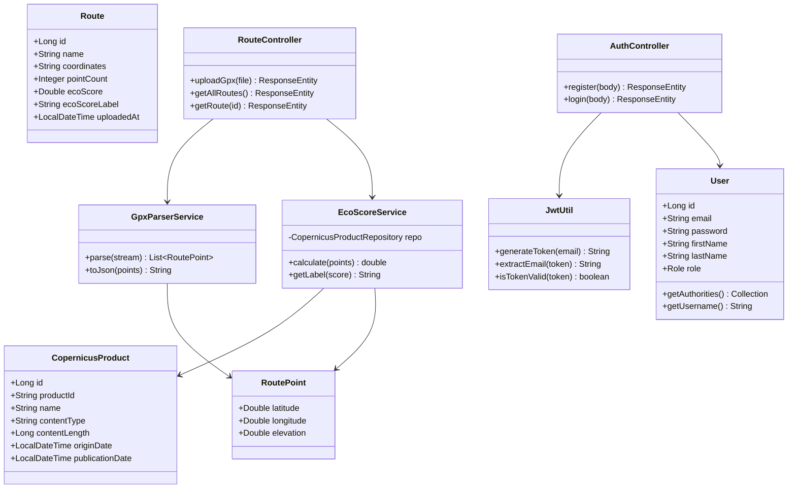
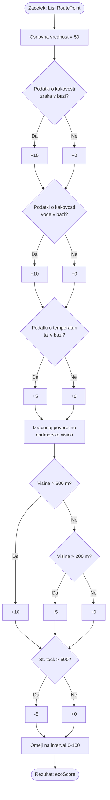
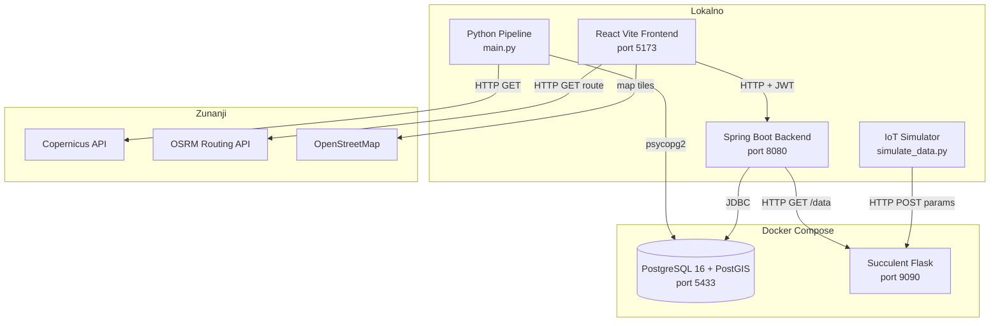
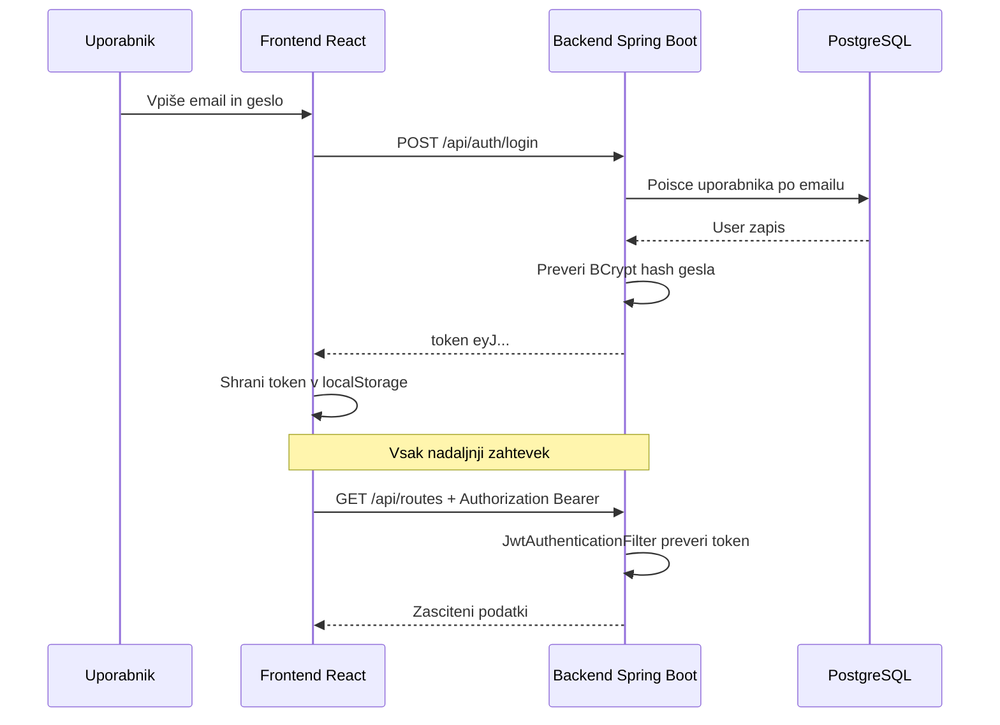
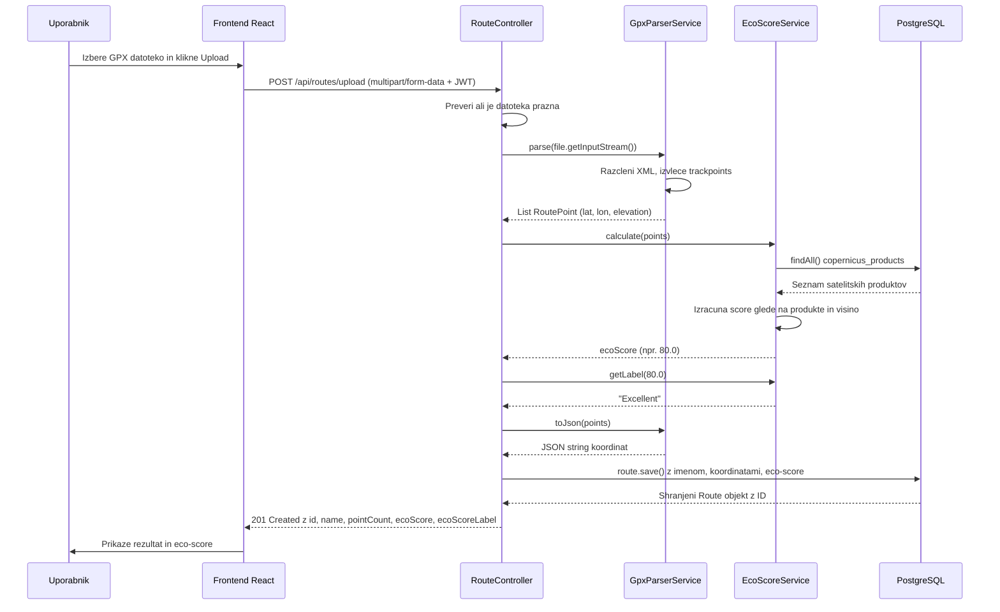
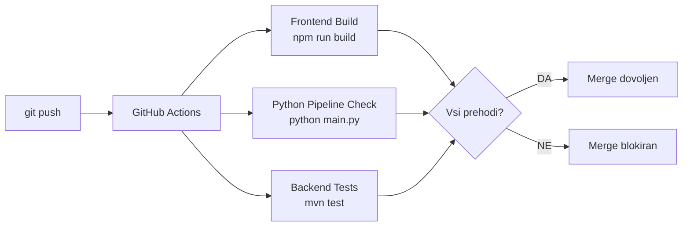

# EcoFlow

> Platforma za vizualizacijo okoljskih podatkov in priporočanje ekološko prijaznih poti v Sloveniji.

EcoFlow je spletna aplikacija, ki združuje **satelitske okoljske meritve** (Copernicus), **GPS podatke uporabnikov** (GPX datoteke) in **IoT senzorske meritve v realnem času** (Succulent) v enoten sistem, ki uporabniku priporoča ekološko najprimernejše rekreativne poti.

Projekt se razvija v okviru učne enote *Projekt (IPT UN – 3. letnik)* na Fakulteti za elektrotehniko, računalništvo in informatiko Univerze v Mariboru.

---

## Kazalo vsebine

- [Projektna ekipa](#projektna-ekipa)
- [Namen in cilji](#namen-in-cilji)
- [Sistemska arhitektura](#sistemska-arhitektura)
- [Tok podatkov (Data Flow)](#tok-podatkov)
- [ER diagram – podatkovna baza](#er-diagram)
- [Use Case diagram](#use-case-diagram)
- [Razredni diagram – backend](#razredni-diagram)
- [Komponentni diagram – deployment](#komponentni-diagram)
- [REST API](#rest-api)
- [Varnost in avtentikacija](#varnost-in-avtentikacija)
- [Tehnološki sklad](#tehnološki-sklad)
- [Struktura projekta](#struktura-projekta)
- [Zagotavljanje kakovosti](#zagotavljanje-kakovosti)
- [Vodenje projekta – Scrum](#vodenje-projekta)
- [Načrtovano za prihodnje iteracije](#načrtovano-za-prihodnje-iteracije)
- [Namestitev in zagon](#namestitev-in-zagon)

---

## Projektna ekipa

| Ime in priimek       | Področje dela                         |
|----------------------|---------------------------------------|
| Kristijan Stefanoski | Backend razvoj, sistemska arhitektura |
| Anastasija Necoska   | Frontend razvoj, uporabniški vmesnik  |
| Luka Kitanovski      | Data pipeline in integracija API-jev  |
| Aleksa Vucinic       | Podatkovna baza in infrastruktura     |

---

## Namen in cilji

Projekt rešuje problem **omejene dostopnosti in interpretacije okoljskih podatkov** za navadne uporabnike. Obstoječe rešitve prikazujejo surove meritve ali statične analize, EcoFlow pa omogoča **praktična priporočila** glede na trenutne okoljske razmere.

Sistem uporabniku omogoča:
- pregled okoljskih podatkov na interaktivnem zemljevidu,
- filtriranje satelitskih meritev po tipu (kakovost zraka, temperatura tal, kakovost vode) in datumu,
- uvoz in analizo lastnih GPX rekreativnih poti,
- izračun **eco-score** vrednosti za vsako pot (0–100),
- načrtovanje poti med dvema točkama z izborom strategije (ekološka / hitra / uravnotežena),
- pregled live IoT senzorskih meritev z naprav po Sloveniji,
- personalizacijo izkušnje prek **Eco Profila**.

---

## Sistemska arhitektura

Sistem je razdeljen na **5 neodvisnih komponent**, ki komunicirajo prek REST API-jev in skupne podatkovne baze.



---

## Tok podatkov

Podatki v sistem prihajajo iz treh neodvisnih virov in se združijo v eno podatkovno bazo ter prikažejo v frontendu.



**Razlaga toka:**

1. **Python pipeline** periodično pokliče Copernicus API, transformira JSON odgovor in shrani satelitske produkte v bazo. Ob nedosegljivosti API-ja se uporabi lokalni testni dataset.
2. **Uporabnik naloži GPX datoteko** → backend jo razčleni, izvleče koordinate in višino, izračuna eco-score ter shrani pot v bazo.
3. **IoT simulator** pošilja meritve na Succulent strežnik (HTTP POST z URL parametri). Backend na zahtevo frontendu posreduje zadnje meritve iz Succulent strežnika.

---

## ER diagram

Podatkovna baza vsebuje tri glavne entitete:



- `users.email` je unikaten in se uporablja kot uporabniško ime za JWT
- `routes.coordinates` hrani JSON array `[{latitude, longitude, elevation}, ...]`
- `copernicus_products.productId` je unikaten ID iz Copernicus kataloga – duplikati se ob konfliktu posodobijo (upsert)

> Opomba: V prihodnji iteraciji bo dodana relacija `user_id` na tabeli `routes`, da vsak uporabnik vidi samo svoje poti.

---

## Use Case diagram



---

## Razredni diagram

Razredni diagram prikazuje ključne entitete in servise backend aplikacije.



**Logika izračuna eco-score – activity diagram:**



**Tabela točkovanja:**

| Pogoj | Točke |
|-------|-------|
| Osnovna vrednost | +50 |
| Podatki o kakovosti zraka v bazi | +15 |
| Podatki o kakovosti vode v bazi | +10 |
| Podatki o temperaturi tal v bazi | +5 |
| Povprečna nadmorska višina > 500 m | +10 |
| Povprečna nadmorska višina > 200 m | +5 |
| Pot ima > 500 track točk | -5 |

Končna vrednost je omejena na interval **[0, 100]**.

---

## Komponentni diagram

Prikazuje, kako posamezne komponente tečejo in kateri porti so izpostavljeni.



---

## REST API

Vsi endpointi (razen `/api/health` in `/api/auth/**`) zahtevajo JWT Bearer token:

```
Authorization: Bearer <token>
```

### Avtentikacija

| Metoda | Endpoint             | Opis                           | Avtentikacija |
|--------|----------------------|--------------------------------|---------------|
| POST   | `/api/auth/register` | Registracija novega uporabnika | Ne            |
| POST   | `/api/auth/login`    | Prijava, vrne JWT token        | Ne            |
| GET    | `/api/health`        | Statusni pregled sistema       | Ne            |

**Primer prijave:**
```json
POST /api/auth/login
{ "email": "user@example.com", "password": "geslo123" }

Odgovor:
{ "token": "eyJhbGciOiJIUzI1NiJ9..." }
```

### Okoljski podatki

| Metoda | Endpoint                   | Opis                                 |
|--------|----------------------------|--------------------------------------|
| GET    | `/api/copernicus-products` | Vrne vse satelitske produkte iz baze |

### GPX Poti

| Metoda | Endpoint              | Opis                                    |
|--------|-----------------------|-----------------------------------------|
| POST   | `/api/routes/upload`  | Naloži GPX datoteko, izračuna eco-score |
| GET    | `/api/routes`         | Vrne seznam vseh poti (brez koordinat)  |
| GET    | `/api/routes/{id}`    | Vrne posamezno pot z vsemi koordinatami |

**Primer odgovora za nalaganje GPX:**
```json
{
  "id": 5,
  "name": "gorska_pot.gpx",
  "pointCount": 347,
  "ecoScore": 80.0,
  "ecoScoreLabel": "Excellent"
}
```

### Succulent IoT podatki

| Metoda | Endpoint               | Opis                                           |
|--------|------------------------|------------------------------------------------|
| GET    | `/api/succulent-data`  | Vrne zadnje IoT meritve iz Succulent strežnika |

**Primer odgovora (ko succulent teče):**
```json
[
  {
    "latitude": "46.0612",
    "longitude": "14.5021",
    "air_quality": "78.3",
    "temperature": "21.5",
    "eco_score": "82.1",
    "activity_type": "WALKING",
    "timestamp": "2024-06-05T10:23:11"
  }
]
```

**Ob nedosegljivosti Succulent strežnika:**
```json
{
  "status": "unavailable",
  "message": "Succulent data collection server is not running.",
  "data": []
}
```

---

## Varnost in avtentikacija

Sistem uporablja **JWT (JSON Web Token)** avtentikacijo brez strežniških sej (stateless).



**Varnostni mehanizmi:**
- Gesla hashirana z **BCrypt** (nikoli shranjeno v čistem tekstu)
- JWT token vsebuje email in čas veljavnosti
- `JwtAuthenticationFilter` preveri vsak zahtevek pred dostopom do zaščitenih virov
- CORS omejen izključno na `http://localhost:5173`
- Seje so **stateless** (`SessionCreationPolicy.STATELESS`)

### Sequence diagram – nalaganje GPX poti

Ključni tok: od nalaganja datoteke do shranjenega eco-score v bazi.



---

## Tehnološki sklad

| Plast           | Tehnologija             | Namen                                |
|-----------------|-------------------------|--------------------------------------|
| Frontend        | React 18 + Vite 5       | Uporabniški vmesnik (SPA)            |
| Frontend        | React Leaflet           | Interaktivni zemljevid               |
| Frontend        | React Router 6          | Navigacija med stranmi               |
| Frontend        | Axios                   | HTTP zahtevki na backend             |
| Backend         | Spring Boot 3           | REST API strežnik                    |
| Backend         | Spring Security 6       | JWT avtentikacija                    |
| Backend         | Lombok                  | Redukcija boilerplate kode           |
| Podatkovna baza | PostgreSQL 16 + PostGIS | Relacijska baza s prostorsko razšir. |
| Pipeline        | Python + Requests       | Pridobivanje Copernicus podatkov     |
| Pipeline        | psycopg2                | Povezava s PostgreSQL iz Pythona     |
| IoT zbiranje    | Succulent (Flask)       | HTTP POST zbiratelj meritev          |
| Routing         | OSRM (project-osrm.org) | Izračun pešpoti med točkami          |
| Zemljevid       | OpenStreetMap           | Podloga karte                        |
| Infrastruktura  | Docker + Compose        | Kontejnerizacija baze                |
| CI/CD           | GitHub Actions          | Avtomatsko testiranje ob push-u      |

### Utemeljitev arhitekturnih odločitev

**Zakaj React?**
React omogoča komponentno gradnjo vmesnika, kar je ključno za kompleksen projekt z zemljevidom, dashboardom in večimi stranmi. Vite zagotavlja izredno hitro lokalno razvojno okolje z HMR (hot module replacement).

**Zakaj Spring Boot?**
Ekipa ima predhodno znanje z Javo. Spring Boot ponuja celovit ekosistem: vgrajeno varnost (Spring Security), ORM (Hibernate/JPA), in enostavno vzpostavitev REST API-ja brez konfiguracije od začetka. JWT integracija je standardizirana.

**Zakaj PostgreSQL + PostGIS?**
Projekt dela s prostorskimi podatki (GPS koordinate, geografske regije). PostGIS razširitev PostgreSQL dodaja prostorske tipe in indekse, kar bo v prihodnosti omogočilo napredne prostorske poizvedbe (npr. kateri okoljski podatki so znotraj 5 km od poti). PostgreSQL je tudi brezplačen in odprtokoden.

**Zakaj Python za pipeline?**
Python ima najbogatejši ekosistem za obdelavo podatkov (Pandas, Requests). Copernicus API vrača kompleksne JSON odgovore, ki jih je v Pythonu enostavno transformirati. Pipeline je ločena komponenta, kar omogoča neodvisno izvajanje brez vplivanja na backend.

**Zakaj Succulent?**
Succulent je lahek Flask-based strežnik, ki zbira podatke prek HTTP POST zahtevkov — standardni protokol za IoT naprave. Mentor je predlagal vključitev platforme za zbiranje podatkov, da pokrijemo celoten podatkovni ekosistem (satelit + GPS + IoT senzorji). Ker nimamo fizičnih naprav, simulator posnema realne meritve.

**Zakaj Docker samo za bazo?**
V razvojni fazi je kontejnerizacija celotnega sistema prekomplicirana. Docker zagotavlja konzistentno PostgreSQL okolje na vseh razvojnih računalnikih brez ročne namestitve. Backend, frontend in pipeline tečejo lokalno za lažje debugiranje.

**Zakaj GitHub Actions za CI/CD?**
GitHub Actions je tesno integriran z repozitorijem in brezplačen za javne repozitorije. Zagotavlja, da nobena koda z neuspešnimi testi ne pride v vejo `main`, kar je temelj zagotavljanja kakovosti.

---

## Struktura projekta

```
ecoflow/
│
├── frontend/                           # React aplikacija (Vite)
│   └── src/
│       ├── App.jsx                     # Glavna aplikacija, routing, interaktivni zemljevid
│       ├── pages/
│       │   ├── LoginPage.jsx           # Stran za prijavo
│       │   ├── RegisterPage.jsx        # Stran za registracijo
│       │   ├── GpxUploadPage.jsx       # Nalaganje GPX datotek
│       │   ├── StatsDashboardPage.jsx  # Dashboard + live sensor data
│       │   └── EcoProfilePage.jsx      # Eco profil uporabnika
│       ├── services/
│       │   └── authService.js          # JWT shranjevanje / preverjanje
│       └── test/                       # Frontend unit testi (Vitest)
│
├── backend/                            # Spring Boot aplikacija
│   └── src/main/java/backend/
│       ├── config/
│       │   ├── SecurityConfig.java             # Spring Security + CORS + JWT filter
│       │   ├── JwtAuthenticationFilter.java    # Preverjanje JWT pri vsakem zahtevku
│       │   └── JwtUtil.java                    # Generiranje in validacija JWT tokenov
│       ├── controller/
│       │   ├── AuthController.java             # POST /api/auth/register + /login
│       │   ├── RouteController.java            # POST /upload, GET /api/routes
│       │   ├── CopernicusProductController.java
│       │   └── SucculentDataController.java    # GET /api/succulent-data
│       ├── model/
│       │   ├── User.java, Route.java, RoutePoint.java
│       │   └── CopernicusProduct.java, Role.java
│       ├── repository/                 # JPA repozitoriji (Spring Data)
│       └── service/
│           ├── EcoScoreService.java    # Algoritem za izračun eco-score
│           └── GpxParserService.java  # Razčlenjevanje GPX XML datotek
│
├── pipeline/                           # Python data pipeline
│   ├── main.py                         # Pridobivanje + transformacija + shranjevanje
│   ├── scheduler.py                    # Periodično izvajanje pipeline-a
│   └── test_data/sample_data.json      # Lokalni testni dataset (fallback)
│
├── succulent/                          # IoT zbiratelj podatkov
│   ├── run.py                          # Zagon Succulent strežnika na :9090
│   ├── configuration.yml               # Definicija parametrov (lat, lng, air_quality...)
│   ├── simulate_data.py                # Simulator IoT naprav (8 lokacij v Sloveniji)
│   └── requirements.txt
│
├── docker/
│   └── docker-compose.yml              # PostgreSQL + PostGIS kontejner
│
├── docks/                              # Dodatna dokumentacija
│   ├── diagrams/                       # UML diagrami
│   ├── architecture/                   # Arhitekturne odločitve
│   └── sprints/                        # Sprint dokumentacija
│
└── .github/workflows/                  # GitHub Actions CI pipeline
```

---

## Zagotavljanje kakovosti

### Avtomatizirani testi

**Frontend – Vitest + React Testing Library:**
```
frontend/src/test/
├── LoginPage.test.jsx       # Testira prikaz forme, validacijo, napake
├── RegisterPage.test.jsx    # Testira registracijo, duplikat email
└── GpxUploadPage.test.jsx   # Testira nalaganje datoteke, odgovor backenda
```

**Backend – JUnit 5 + Mockito:**
```
backend/src/test/java/backend/
├── controller/RouteControllerTest.java      # Unit testi za upload GPX in pridobivanje
└── integration/
    ├── AuthIntegrationTest.java             # E2E test registracije in prijave
    └── RouteIntegrationTest.java            # E2E test nalaganja in branja poti
```

### CI/CD pipeline (GitHub Actions)

Ob vsakem `push` ali `pull_request` v vejo `main` se samodejno izvede:



Merge v `main` je mogoč šele, ko **vsi trije koraki** uspešno zaključijo.

---

## Vodenje projekta

Projekt temelji na **Scrum** agilni metodologiji z **enotedenskimi sprint iteracijami**.

**Orodja:**
- **GitHub Issues** – sledenje nalogam in napakam
- **GitHub Projects (Kanban)** – vizualizacija statusa (To Do / In Progress / Done)
- **Pull Requests** – obvezen code review pred mergom v `main`
- **GitHub Actions** – avtomatizirano testiranje ob vsaki spremembi

### Zaključene iteracije

| Iteracija | Vsebina                                                                      | Status     |
|-----------|------------------------------------------------------------------------------|------------|
| 1         | Vzpostavitev okolja (frontend, backend, baza), osnoven REST API              | ✅ Končano |
| 2         | Python data pipeline, pridobivanje Copernicus podatkov, shranjevanje v bazo  | ✅ Končano |
| 3         | Interaktivni zemljevid (Leaflet), prikaz okoljskih podatkov, filtriranje     | ✅ Končano |
| 4         | GPX uvoz, izračun eco-score, prikaz poti na zemljevidu                       | ✅ Končano |
| 5         | Eco Profil, dashboard, Succulent IoT integracija, CI/CD, personalizacija     | ✅ Končano |

---

## Namestitev in zagon

### Predpogoji

- **Java 21+** – za Spring Boot backend
- **Node.js 18+** – za React frontend
- **Python 3.9+** – za pipeline in succulent
- **Docker + Docker Compose** – za PostgreSQL
- **Maven** – za backend build

### 1. Kloniranje repozitorija

```bash
git clone https://github.com/Lupet007/ecoflow.git
cd ecoflow
```

### 2. Zagon podatkovne baze (Docker)

```bash
cd docker
docker-compose up -d
```

Baza PostgreSQL + PostGIS bo dostopna na `localhost:5433`.
Konfiguracija: DB `ecoflow`, user `ecoflow`, password `ecoflow`.

### 3. Zagon Spring Boot backenda

```bash
cd backend
mvn spring-boot:run
```

Backend teče na `http://localhost:8080`. Spring Boot ob prvem zagonu samodejno ustvari tabele (Hibernate DDL auto).

### 4. Zagon Python pipeline (enkratno)

```bash
cd pipeline
pip install -r requirements.txt
python main.py
```

Pipeline prenese satelitske produkte iz Copernicus API-ja in jih shrani v bazo. Ob nedosegljivosti API-ja se samodejno uporabi lokalni testni dataset.

### 5. Zagon React frontenda

```bash
cd frontend
npm install
npm run dev
```

Frontend teče na `http://localhost:5173`.

### 6. Zagon Succulent IoT zbiratelja (opcijsko)

Za prikaz **Live sensor data** sekcije v dashboardu:

**Terminal 1 – Succulent strežnik:**
```bash
cd succulent
pip install succulent --no-deps
pip install flask pandas pyyaml requests
python run.py
```

**Terminal 2 – IoT simulator:**
```bash
cd succulent
python simulate_data.py
```

Simulator pošilja meritve vsakih 3 sekunde z naključnih lokacij po Sloveniji.

### Povzetek portov

| Komponenta       | Port | URL                        |
|------------------|------|----------------------------|
| Frontend (React) | 5173 | http://localhost:5173      |
| Backend (Spring) | 8080 | http://localhost:8080      |
| PostgreSQL       | 5433 | localhost:5433             |
| Succulent IoT    | 9090 | http://localhost:9090      |

---

## Načrtovano za prihodnje iteracije

Naslednje funkcionalnosti so bile **opredeljene v začetni viziji projekta**, vendar **niso bile implementirane** v sklopu petih iteracij zaradi časovnih omejitev ali tehničnih odvisnosti. Predvidene so za nadaljevanje razvoja.

### Gostujoči uporabnik (Guest mode)

Vizija je predvidevala, da bo mogoč ogled zemljevida **brez prijave** – gostujoči uporabnik bi videl okoljske podatke, ne bi pa imel dostopa do GPX uvoza, priporočil in profila. Trenutno sistem zahteva prijavo za vse funkcionalnosti.

### Integracija ARSO API

Kot **alternativni oz. dopolnilni vir** okoljskih podatkov je bila načrtovana integracija z ARSO (Agencija RS za okolje) odprtimi podatki. Copernicus je primarni vir, ARSO pa bi zagotovil lokalno specifične meritve za Slovenijo (PM2.5, NO2, temperatura). Trenutno se ob nedosegljivosti Copernicus API-ja uporabi lokalni testni dataset.

### Napredni filtri onesnaževal

Vizija je vključevala filtriranje po specifičnih onesnažilih: **PM2.5, NO2, temperatura**. Trenutna implementacija loči samo po splošnih tipih (kakovost zraka, kakovost vode, temperatura tal), brez vrednosti posameznih onesnažil.

### Zgodovinski trendi in primerjava regij

Dashboard je bil načrtovan z **vizualizacijo zgodovinskih trendov** (kako se je kakovost zraka v regiji spreminjala skozi čas) in **primerjavo med regijami**. Trenutni dashboard prikazuje statistične podatke o produktih in poteh, ne pa časovnih trendov.

### Personalizirana priporočila za zdravstveno občutljive uporabnike

Vizija je predvidevala prilagojene filtre in priporočila za uporabnike z zdravstvenimi posebnostmi (npr. astmatiki). Eco Profil trenutno podpira izbiro aktivnosti in regije, ne pa zdravstvenih parametrov.

### Relacija med uporabnikom in potmi

Trenutno so vse poti vidne vsem prijavljenim uporabnikom. Načrtovana je uvedba `user_id` tujega ključa na tabeli `routes`, da vsak uporabnik vidi in upravlja samo svoje poti.

### Polna kontejnerizacija (Docker Compose za vse komponente)

Trenutno sta v Docker Compose samo PostgreSQL in Succulent. Načrtovana je kontejnerizacija backend in frontend komponent za popolno prenosljivost sistema.

---

## Licenca

Projekt je razvit za akademske in izobraževalne namene v okviru učne enote Projekt (IPT UN) na FERI, Univerza v Mariboru.